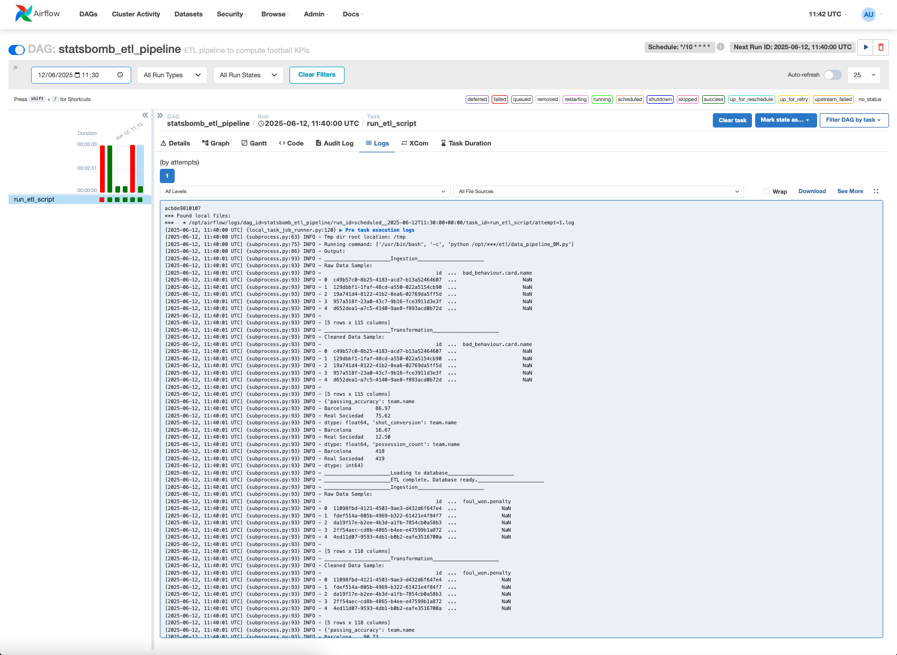
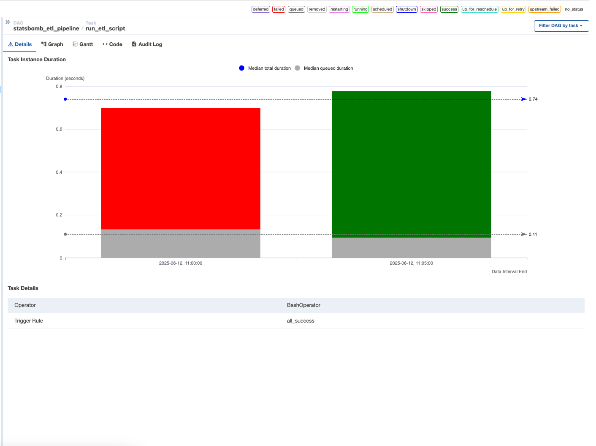
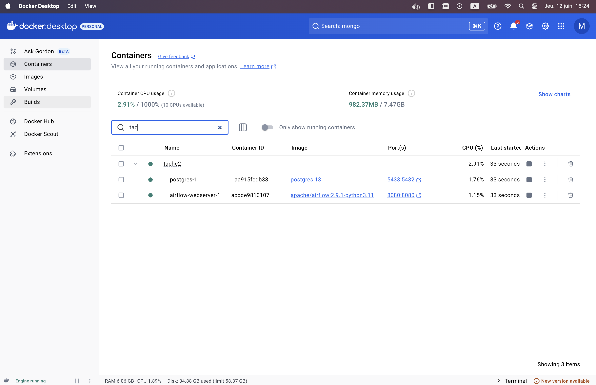
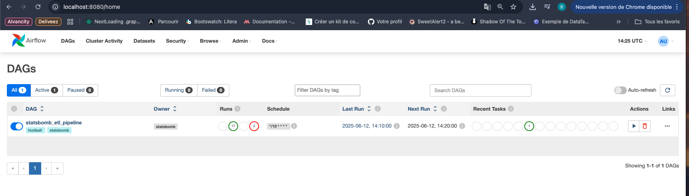

# ⚽ Monaco Test technique (Tache 2): Projet ETL StatsBomb avec Apache Airflow et Docker 🐳

---

## 📋 Description

Ce projet est un pipeline ETL (Extract, Transform, Load) pour analyser des données footballistiques issues de StatsBomb.  
Le pipeline permet d'ingérer les fichiers JSON d'événements, de transformer les données pour calculer des KPI (indicateurs de performance clés) comme la précision de passe, la possession, le taux de conversion de tirs, puis de charger ces résultats dans une base SQLite.

Le workflow est orchestré avec Apache Airflow, déployé dans des containers Docker pour assurer modularité, portabilité et reproductibilité.

---

## 🏗️ Architecture technique

- **Apache Airflow** : orchestrateur des tâches ETL, permet de planifier et monitorer les DAGs (pipelines). ⏰
- **Docker** : containerisation de l’ensemble (Airflow, PostgreSQL pour Airflow metadata, ETL Python). 🐳
- **PostgreSQL** : base de données utilisée par Airflow pour stocker ses métadonnées. 🗄️
- **SQLite** : base légère utilisée pour stocker les données transformées et les KPI calculés. 💾
- **Python** : pour le développement des scripts ETL (ingestion, transformation, chargement). 🐍
- **BashOperator + DockerOperator dans Airflow** : exécution du script ETL dans un container dédié. ⚙️

---

## 📝 Choix techniques

- Utilisation de **Docker Compose** pour faciliter le déploiement local complet (Airflow + Postgres + ETL).  
- Base SQLite légère pour la persistance des KPI, facile à consulter et copier hors du container.  
- Gestion des connexions Airflow via variables d’environnement dans Docker Compose pour simplifier la configuration.  
- Planification du DAG en mode cron (ex: toutes les 10 minutes) pour un monitoring et une exécution régulière. ⏳

---

## ⚙️ Prérequis

- Docker & Docker Compose installés et fonctionnels  
- Accès terminal / ligne de commande

---

## 🚀 Installation & Exécution

1. **Cloner le dépôt**

```bash
git clone https://github.com/mbirame2/test_technique/tree/tasktwo
```

2. **Démarrer la stack**

```bash
docker compose  up -d
```

3. **Accéder à l’interface Airflow**

Ouvrir dans un navigateur :  
[http://localhost:8080](http://localhost:8080)  
Login : `airflow` / `airflow` 🔐

4. **Déclencher et monitorer le DAG** `statsbomb_etl_pipeline`  
- Le DAG est configuré pour s’exécuter toutes les 10 minutes ⏲️  
- Visualiser les logs des tâches dans l’UI Airflow 📊

---

## 📁 Structure des dossiers

```
├── dags/                # Contient les fichiers DAG Airflow
│   └── etl_pipeline_dag.py
├── etl/                 # Code source des scripts ETL
│   ├── ingestion.py
│   ├── transformation.py
│   ├── loading.py
│   ├── data_pipeline_BM.py
│   └── utils.py
├── data/                # Données statiques ou d’exemple (JSON)
├── docker-compose.yml   # Orchestration des containers
├── requirements.txt     # Dépendances Python
└── README_BM.md         # Ce fichier
└── README.md            # Fichier pour l affichage sur github
```

---

---

## 🛠️ Fonctionnement du code ETL

Le script principal `data_pipeline_BM.py` qui se trouve dans le repertoire `etl` suit les étapes suivantes :

### 1. 🔍 Ingestion (`ingestion.py`)
- Charge les fichiers `.json` de données brutes se trouvant dans le repertoire parent (ex: `data/events/15946.json`)
- Transforme les données JSON en un **DataFrame Pandas**

### 2. 🧹 Transformation (`transformation.py`)
- Nettoie les données : suppression de colonnes inutiles, formatage, gestion des valeurs manquantes
- Calcule des **KPIs football** comme :
  - 🔁 Précision des passes
  - 🔢 Taux de conversion des tirs
  - 🔄 Possession du ballon, etc.

### 3. 💾 Chargement (`loading.py`)
- Enregistre les résultats transformés dans une base de données **SQLite**

---

## 🛠️ Resultat

- Les resultats de chaque operation du DAG Configure :

- Les tests qui ont ete faits :  

- Les containers docker :  

- Page d'accueil d’Apache Airflow:  

---


---

## 🛠️ Debug

- Pour accéder à la base SQLite générée, récupérer le fichier `.db` dans le container ETL via `docker cp`.  
- Pour afficher les tables SQLite :  
  ```bash
  sqlite3 <database_file>.db
  .tables
  ```  
- Assurez-vous que les volumes Docker sont bien montés pour persister les données.  
- En cas de problème de démarrage Airflow, vérifier que la DB Postgres est accessible et que la migration est effectuée (`airflow db init` / `airflow db migrate`).  

---

